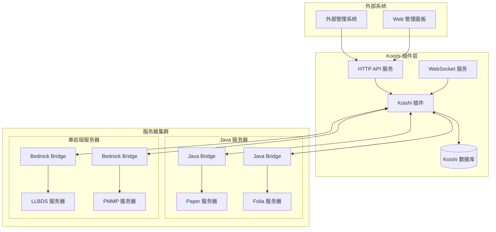
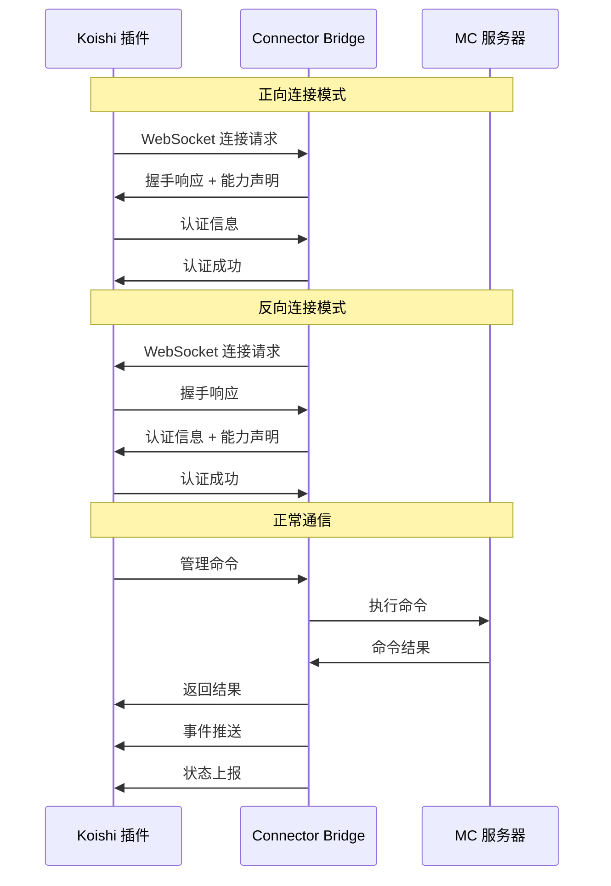

# Mochi-Link (大福连) - 设计文档

## 概述

Mochi-Link（大福连）是一个 Minecraft 统一管理与监控系统，如同大福（麻薯）一样具有极强的黏性和包容性，把各种核心（LLBDS、Paper、Folia 等）软糯地包裹在一起。系统采用双端协作架构，通过标准化的 U-WBP v2 协议实现跨核心、跨版本、跨平台的统一管理。

### 核心设计理念

1. **统一抽象**：将不同 Minecraft 核心的差异抽象为统一的 WebSocket API
2. **双向连接**：支持正向和反向连接模式，适应不同网络架构
3. **多模式接入**：支持插件、RCON、终端注入等多种服务器接入方式
4. **实时同步**：通过事件推送和定时上报实现实时状态同步
5. **权限分离**：基于服务器 ID 的细粒度权限控制

## 架构

### 系统架构图



### 连接架构



## 组件和接口

### 1. Koishi 插件组件

#### 1.1 核心管理器 (CoreManager)
负责管理所有服务器连接和协调各个子系统。

```typescript
interface CoreManager {
  // 服务器连接管理
  registerServer(config: ServerConfig): Promise<void>
  unregisterServer(serverId: string): Promise<void>
  getServerStatus(serverId: string): ServerStatus
  
  // 连接模式管理
  establishConnection(serverId: string, mode: ConnectionMode): Promise<Connection>
  switchConnectionMode(serverId: string, newMode: ConnectionMode): Promise<void>
  
  // 全局操作
  broadcastCommand(command: string, serverIds?: string[]): Promise<CommandResult[]>
  getSystemHealth(): SystemHealth
}
```

#### 1.2 协议处理器 (ProtocolHandler)
处理 U-WBP v2 协议的消息解析和路由。

```typescript
interface ProtocolHandler {
  // 消息处理
  handleMessage(connection: Connection, message: UWBPMessage): Promise<void>
  sendMessage(connection: Connection, message: UWBPMessage): Promise<void>
  
  // 协议管理
  validateMessage(message: any): boolean
  createResponse(requestId: string, data: any, error?: string): UWBPMessage
  createEvent(eventType: string, data: any): UWBPMessage
}
```

#### 1.3 权限管理器 (PermissionManager)
基于 Koishi 权限系统的服务器级权限控制。

```typescript
interface PermissionManager {
  // 权限检查
  checkPermission(userId: string, serverId: string, operation: string): Promise<boolean>
  
  // 角色管理
  assignRole(userId: string, serverId: string, role: ServerRole): Promise<void>
  removeRole(userId: string, serverId: string, role: ServerRole): Promise<void>
  
  // 权限查询
  getUserPermissions(userId: string, serverId: string): Promise<Permission[]>
  getServerAdmins(serverId: string): Promise<User[]>
}
```

#### 1.4 数据同步器 (DataSynchronizer)
处理服务器数据的双端同步和离线操作缓存。

```typescript
interface DataSynchronizer {
  // 白名单同步
  syncWhitelist(serverId: string): Promise<void>
  cacheWhitelistOperation(serverId: string, operation: WhitelistOperation): Promise<void>
  
  // 玩家信息同步
  syncPlayerInfo(serverId: string): Promise<void>
  resolvePlayerIdentity(playerData: PlayerData[]): PlayerIdentity
  
  // 离线操作管理
  processPendingOperations(serverId: string): Promise<void>
  optimizeOperationCache(serverId: string): Promise<void>
}
```

### 2. Connector Bridge 组件

#### 2.1 连接适配器 (ConnectionAdapter)
根据不同接入模式建立与服务器的连接。

```typescript
interface ConnectionAdapter {
  // 连接管理
  connect(config: ConnectionConfig): Promise<void>
  disconnect(): Promise<void>
  isConnected(): boolean
  
  // 模式特定方法
  connectViaPlugin(): Promise<void>
  connectViaRCON(host: string, port: number, password: string): Promise<void>
  connectViaTerminal(processId: number): Promise<void>
}
```

#### 2.2 核心抽象器 (CoreAbstractor)
将不同核心的原生接口转换为统一的抽象接口。

```typescript
interface CoreAbstractor {
  // 服务器信息
  getServerInfo(): Promise<ServerInfo>
  getServerStatus(): Promise<ServerStatus>
  
  // 玩家管理
  getPlayerList(): Promise<Player[]>
  getPlayerInfo(playerId: string): Promise<PlayerDetail>
  kickPlayer(playerId: string, reason: string): Promise<void>
  
  // 命令执行
  executeCommand(command: string): Promise<CommandResult>
  
  // 白名单管理
  getWhitelist(): Promise<string[]>
  addToWhitelist(playerId: string): Promise<void>
  removeFromWhitelist(playerId: string): Promise<void>
}
```

#### 2.3 事件监听器 (EventListener)
监听服务器事件并转换为标准事件格式。

```typescript
interface EventListener {
  // 事件监听
  startListening(): void
  stopListening(): void
  
  // 事件处理
  onPlayerJoin(callback: (event: PlayerJoinEvent) => void): void
  onPlayerLeave(callback: (event: PlayerLeaveEvent) => void): void
  onPlayerChat(callback: (event: PlayerChatEvent) => void): void
  onServerStatusChange(callback: (event: ServerStatusEvent) => void): void
  
  // 事件转换
  convertToStandardEvent(nativeEvent: any): StandardEvent
}
```

### 3. HTTP API 接口

#### 3.1 服务器管理 API

```typescript
// GET /api/servers - 获取服务器列表
interface GetServersResponse {
  servers: ServerSummary[]
  total: number
}

// POST /api/servers - 注册新服务器
interface CreateServerRequest {
  name: string
  coreType: CoreType
  connectionMode: ConnectionMode
  connectionConfig: ConnectionConfig
  tags?: string[]
}

// PUT /api/servers/:serverId - 更新服务器配置
interface UpdateServerRequest {
  name?: string
  connectionConfig?: Partial<ConnectionConfig>
  tags?: string[]
}

// DELETE /api/servers/:serverId - 删除服务器
```

#### 3.2 玩家管理 API

```typescript
// GET /api/servers/:serverId/players - 获取玩家列表
interface GetPlayersResponse {
  players: Player[]
  online: number
  total: number
}

// GET /api/servers/:serverId/players/:playerId - 获取玩家详情
interface GetPlayerResponse {
  player: PlayerDetail
  identity: PlayerIdentity
}

// POST /api/servers/:serverId/players/:playerId/kick - 踢出玩家
interface KickPlayerRequest {
  reason: string
}
```

#### 3.3 白名单管理 API

```typescript
// GET /api/servers/:serverId/whitelist - 获取白名单
interface GetWhitelistResponse {
  whitelist: string[]
  synced: boolean
  lastSync: string
}

// POST /api/servers/:serverId/whitelist - 添加白名单
interface AddWhitelistRequest {
  playerId: string
  playerName?: string
}

// DELETE /api/servers/:serverId/whitelist/:playerId - 移除白名单
```

#### 3.4 命令执行 API

```typescript
// POST /api/servers/:serverId/commands - 执行命令
interface ExecuteCommandRequest {
  command: string
  timeout?: number
}

interface ExecuteCommandResponse {
  success: boolean
  output: string[]
  executionTime: number
}
```

## 数据模型

### 数据库表结构

#### 1. minecraft_servers 表
```sql
CREATE TABLE minecraft_servers (
  id VARCHAR(64) PRIMARY KEY,           -- serverId
  name VARCHAR(255) NOT NULL,           -- 显示名称
  core_type VARCHAR(32) NOT NULL,       -- 核心类型 (Java/Bedrock)
  core_name VARCHAR(64),                -- 具体核心名 (Paper/LLBDS等)
  core_version VARCHAR(32),             -- 核心版本
  connection_mode VARCHAR(32) NOT NULL, -- 连接模式 (plugin/rcon/terminal)
  connection_config JSON,               -- 连接配置
  status VARCHAR(32) DEFAULT 'offline', -- 状态 (online/offline/error)
  owner_id VARCHAR(64),                 -- 服主 ID
  tags JSON,                           -- 标签数组
  created_at TIMESTAMP DEFAULT CURRENT_TIMESTAMP,
  updated_at TIMESTAMP DEFAULT CURRENT_TIMESTAMP ON UPDATE CURRENT_TIMESTAMP,
  last_seen TIMESTAMP,                 -- 最后在线时间
  
  INDEX idx_owner (owner_id),
  INDEX idx_status (status),
  INDEX idx_core_type (core_type)
);
```

#### 2. server_acl 表
```sql
CREATE TABLE server_acl (
  id BIGINT AUTO_INCREMENT PRIMARY KEY,
  user_id VARCHAR(64) NOT NULL,        -- 用户 ID
  server_id VARCHAR(64) NOT NULL,      -- 服务器 ID
  role VARCHAR(32) NOT NULL,           -- 角色 (owner/admin/moderator)
  permissions JSON,                    -- 权限列表
  granted_by VARCHAR(64),              -- 授权者
  granted_at TIMESTAMP DEFAULT CURRENT_TIMESTAMP,
  expires_at TIMESTAMP NULL,           -- 过期时间
  
  UNIQUE KEY uk_user_server (user_id, server_id),
  FOREIGN KEY (server_id) REFERENCES minecraft_servers(id) ON DELETE CASCADE,
  INDEX idx_user (user_id),
  INDEX idx_server (server_id)
);
```

#### 3. api_tokens 表
```sql
CREATE TABLE api_tokens (
  id BIGINT AUTO_INCREMENT PRIMARY KEY,
  server_id VARCHAR(64) NOT NULL,      -- 服务器 ID
  token VARCHAR(128) NOT NULL UNIQUE,  -- 认证令牌
  token_hash VARCHAR(256) NOT NULL,    -- 令牌哈希
  ip_whitelist JSON,                   -- IP 白名单
  encryption_config JSON,             -- 加密配置
  created_at TIMESTAMP DEFAULT CURRENT_TIMESTAMP,
  expires_at TIMESTAMP,                -- 过期时间
  last_used TIMESTAMP,                 -- 最后使用时间
  
  FOREIGN KEY (server_id) REFERENCES minecraft_servers(id) ON DELETE CASCADE,
  INDEX idx_server (server_id),
  INDEX idx_token_hash (token_hash)
);
```

#### 4. audit_logs 表
```sql
CREATE TABLE audit_logs (
  id BIGINT AUTO_INCREMENT PRIMARY KEY,
  user_id VARCHAR(64),                 -- 操作者 ID
  server_id VARCHAR(64),               -- 目标服务器
  operation VARCHAR(64) NOT NULL,      -- 操作类型
  operation_data JSON,                 -- 操作详情
  result VARCHAR(32) NOT NULL,         -- 结果 (success/failure/error)
  error_message TEXT,                  -- 错误信息
  ip_address VARCHAR(45),              -- 操作者 IP
  user_agent TEXT,                     -- 用户代理
  created_at TIMESTAMP DEFAULT CURRENT_TIMESTAMP,
  
  INDEX idx_user (user_id),
  INDEX idx_server (server_id),
  INDEX idx_operation (operation),
  INDEX idx_created_at (created_at)
);
```

#### 5. pending_operations 表
```sql
CREATE TABLE pending_operations (
  id BIGINT AUTO_INCREMENT PRIMARY KEY,
  server_id VARCHAR(64) NOT NULL,      -- 目标服务器
  operation_type VARCHAR(32) NOT NULL, -- 操作类型
  target VARCHAR(255),                 -- 操作目标
  parameters JSON,                     -- 操作参数
  status VARCHAR(32) DEFAULT 'pending', -- 状态
  created_at TIMESTAMP DEFAULT CURRENT_TIMESTAMP,
  scheduled_at TIMESTAMP,              -- 计划执行时间
  executed_at TIMESTAMP,               -- 实际执行时间
  
  FOREIGN KEY (server_id) REFERENCES minecraft_servers(id) ON DELETE CASCADE,
  INDEX idx_server_status (server_id, status),
  INDEX idx_scheduled (scheduled_at)
);
```

#### 6. server_bindings 表
```sql
CREATE TABLE server_bindings (
  id BIGINT AUTO_INCREMENT PRIMARY KEY,
  group_id VARCHAR(64) NOT NULL,       -- 群组 ID
  server_id VARCHAR(64) NOT NULL,      -- 服务器 ID
  binding_type VARCHAR(32) DEFAULT 'chat', -- 绑定类型
  config JSON,                         -- 绑定配置
  created_at TIMESTAMP DEFAULT CURRENT_TIMESTAMP,
  
  UNIQUE KEY uk_group_server (group_id, server_id),
  FOREIGN KEY (server_id) REFERENCES minecraft_servers(id) ON DELETE CASCADE,
  INDEX idx_group (group_id),
  INDEX idx_server (server_id)
);
```

#### 7. player_cache 表
```sql
CREATE TABLE player_cache (
  id BIGINT AUTO_INCREMENT PRIMARY KEY,
  uuid VARCHAR(36),                    -- 玩家 UUID
  xuid VARCHAR(32),                    -- 玩家 XUID (基岩版)
  name VARCHAR(16) NOT NULL,           -- 玩家名称
  display_name VARCHAR(32),            -- 显示名称
  last_server_id VARCHAR(64),          -- 最后在线服务器
  last_seen TIMESTAMP,                 -- 最后在线时间
  identity_confidence FLOAT DEFAULT 1.0, -- 身份匹配可信度
  identity_markers JSON,               -- 身份标识符
  is_premium BOOLEAN,                  -- 是否正版
  device_type VARCHAR(32),             -- 设备类型
  created_at TIMESTAMP DEFAULT CURRENT_TIMESTAMP,
  updated_at TIMESTAMP DEFAULT CURRENT_TIMESTAMP ON UPDATE CURRENT_TIMESTAMP,
  
  INDEX idx_uuid (uuid),
  INDEX idx_xuid (xuid),
  INDEX idx_name (name),
  INDEX idx_last_server (last_server_id),
  INDEX idx_last_seen (last_seen)
);
```

### 数据模型接口

#### 核心数据类型

```typescript
// 服务器配置
interface ServerConfig {
  id: string
  name: string
  coreType: 'Java' | 'Bedrock'
  coreName: string
  coreVersion: string
  connectionMode: 'plugin' | 'rcon' | 'terminal'
  connectionConfig: ConnectionConfig
  ownerId: string
  tags: string[]
}

// 连接配置
interface ConnectionConfig {
  // 插件模式
  plugin?: {
    host: string
    port: number
    ssl: boolean
  }
  
  // RCON 模式
  rcon?: {
    host: string
    port: number
    password: string
  }
  
  // 终端注入模式
  terminal?: {
    processId: number
    workingDir: string
    command: string
  }
}

// 玩家信息
interface Player {
  id: string              // UUID 或 XUID
  name: string
  displayName: string
  world: string
  position: {
    x: number
    y: number
    z: number
  }
  ping: number
  isOp: boolean
  permissions: string[]
}

// 玩家详细信息
interface PlayerDetail extends Player {
  firstJoinAt: Date
  lastSeenAt: Date
  totalPlayTime: number
  ipAddress: string
  deviceType: string
  edition: 'Java' | 'Bedrock'
  isPremium: boolean
  identityConfidence: number
}

// 玩家身份识别
interface PlayerIdentity {
  uuid?: string
  xuid?: string
  name: string
  confidence: number
  markers: {
    ip?: string
    device?: string
    firstSeen?: Date
  }
  conflicts: PlayerIdentity[]
}
```
## 正确性属性

*属性是一个特征或行为，应该在系统的所有有效执行中保持为真——本质上是关于系统应该做什么的正式陈述。属性作为人类可读规范和机器可验证正确性保证之间的桥梁。*

基于验收标准分析，以下是系统的核心正确性属性：

### 属性 1：跨核心统一接口一致性
*对于任何*支持的 Minecraft 服务器核心类型（Java 或 Bedrock），当通过 Connector_Bridge 建立连接时，返回的 WebSocket API 接口应符合统一的 U_WBP_v2 协议标准
**验证：需求 1.1, 1.2, 1.3**

### 属性 2：数据持久化完整性
*对于任何*服务器配置注册操作，当操作成功完成时，数据库中应包含所有必需的配置字段（serverId、token、备注、标签等），且数据应可正确检索
**验证：需求 3.1**

### 属性 3：玩家信息格式统一性
*对于任何*服务器类型的玩家信息查询，返回的玩家数据应符合统一的数据结构格式，包含 UUID/XUID、名称、显示名、世界、坐标、延迟等标准字段
**验证：需求 4.1**

### 属性 4：非正版玩家身份识别
*对于任何*具有相同名称但不同 UUID 的玩家数据集合，系统应正确识别并标记潜在的身份冲突，提供匹配可信度评分
**验证：需求 4.3, 4.4**

### 属性 5：离线操作缓存机制
*对于任何*在服务器离线状态下执行的白名单操作，该操作应被正确添加到缓存区，并在服务器上线后按顺序执行
**验证：需求 5.4**

### 属性 6：操作缓存优化
*对于任何*缓存区中针对同一玩家的可抵消操作序列（如添加后立即删除），系统应将其优化为最简形式或无操作
**验证：需求 5.5**

### 属性 7：命令执行往返一致性
*对于任何*有效的控制台命令字符串，当发送到服务器执行时，系统应返回相应的执行结果，且结果应反映命令的实际执行状态
**验证：需求 6.1**

### 属性 8：事件推送完整性
*对于任何*服务器上发生的标准事件（玩家加入、离开、聊天、死亡、成就），系统应推送对应类型的标准化事件消息，包含所有必需的事件字段
**验证：需求 7.1**

### 属性 9：状态上报定时性
*对于任何*在线运行的服务器，Connector_Bridge 应按配置的频率定时上报服务器状态信息，且上报间隔应在预期范围内
**验证：需求 8.1**

### 属性 10：权限检查格式一致性
*对于任何*管理操作的权限检查，系统应使用 "serverId.操作" 格式进行权限验证，且只有具备相应权限的用户才能执行操作
**验证：需求 9.4**

### 属性 11：审计日志完整性
*对于任何*执行的管理操作，系统应在审计日志中记录操作者、目标服务器、操作内容、执行时间和结果等完整信息
**验证：需求 10.1**

### 属性 12：协议消息格式标准化
*对于任何*通过 WebSocket 发送的消息，都应符合 U_WBP_v2 协议的 JSON 格式标准，包含 type、id、op、data 等必需字段
**验证：需求 11.1**

### 属性 13：连接握手流程完整性
*对于任何*新建立的 WebSocket 连接，系统应完成包含认证和能力声明交换的完整握手流程
**验证：需求 11.4**

### 属性 14：自动重连指数退避
*对于任何*WebSocket 连接断开事件，系统应实现指数退避模式的自动重连，重连间隔应按指数增长直到连接恢复或达到最大重试次数
**验证：需求 12.1**

## 错误处理

### 连接错误处理

#### 1. WebSocket 连接失败
```typescript
interface ConnectionErrorHandler {
  handleConnectionFailure(serverId: string, error: ConnectionError): Promise<void> {
    // 记录错误日志
    await this.auditLogger.logError(serverId, 'connection_failed', error)
    
    // 更新服务器状态
    await this.serverManager.updateStatus(serverId, 'error')
    
    // 启动重连机制
    await this.reconnectionManager.scheduleReconnect(serverId, error.retryAfter)
    
    // 通知管理员
    await this.notificationService.notifyConnectionFailure(serverId, error)
  }
}
```

#### 2. 认证失败处理
```typescript
interface AuthenticationErrorHandler {
  handleAuthFailure(serverId: string, reason: AuthFailureReason): Promise<void> {
    // 记录认证失败
    await this.auditLogger.logAuthFailure(serverId, reason)
    
    // 检查是否为令牌过期
    if (reason === 'token_expired') {
      await this.tokenManager.refreshToken(serverId)
      return
    }
    
    // 禁用自动重连（需要人工干预）
    await this.reconnectionManager.disableAutoReconnect(serverId)
    
    // 发送告警
    await this.alertService.sendAuthFailureAlert(serverId, reason)
  }
}
```

#### 3. 协议错误处理
```typescript
interface ProtocolErrorHandler {
  handleProtocolError(connection: Connection, error: ProtocolError): Promise<void> {
    // 记录协议错误
    await this.logger.error('Protocol error', { 
      serverId: connection.serverId, 
      error: error.message,
      messageId: error.messageId 
    })
    
    // 发送错误响应
    if (error.messageId) {
      await connection.sendError(error.messageId, error.code, error.message)
    }
    
    // 严重协议错误时断开连接
    if (error.severity === 'critical') {
      await connection.disconnect()
      await this.reconnectionManager.scheduleReconnect(connection.serverId, 5000)
    }
  }
}
```

### 数据错误处理

#### 1. 数据库操作失败
```typescript
interface DatabaseErrorHandler {
  async handleDatabaseError(operation: string, error: DatabaseError): Promise<void> {
    // 记录数据库错误
    await this.logger.error('Database operation failed', {
      operation,
      error: error.message,
      code: error.code
    })
    
    // 实现重试逻辑
    if (this.isRetryableError(error)) {
      await this.retryManager.scheduleRetry(operation, error.retryDelay)
      return
    }
    
    // 不可重试的错误，发送告警
    await this.alertService.sendDatabaseAlert(operation, error)
  }
  
  private isRetryableError(error: DatabaseError): boolean {
    const retryableCodes = ['CONNECTION_LOST', 'TIMEOUT', 'DEADLOCK']
    return retryableCodes.includes(error.code)
  }
}
```

#### 2. 数据同步冲突
```typescript
interface SyncConflictHandler {
  async handleSyncConflict(serverId: string, conflict: SyncConflict): Promise<void> {
    switch (conflict.type) {
      case 'whitelist_mismatch':
        // 以服务器端数据为准
        await this.dataSynchronizer.forceSync(serverId, 'server_to_koishi')
        break
        
      case 'player_identity_conflict':
        // 标记冲突，需要人工处理
        await this.playerManager.markIdentityConflict(conflict.playerId, conflict.details)
        await this.notificationService.notifyIdentityConflict(serverId, conflict)
        break
        
      case 'operation_conflict':
        // 合并操作或选择最新的
        await this.operationManager.resolveConflict(conflict)
        break
    }
  }
}
```

### 业务逻辑错误处理

#### 1. 权限验证失败
```typescript
interface PermissionErrorHandler {
  async handlePermissionDenied(userId: string, serverId: string, operation: string): Promise<void> {
    // 记录权限拒绝
    await this.auditLogger.logPermissionDenied(userId, serverId, operation)
    
    // 检查是否为权限配置错误
    const userRoles = await this.permissionManager.getUserRoles(userId, serverId)
    if (userRoles.length === 0) {
      await this.alertService.sendPermissionConfigAlert(userId, serverId)
    }
    
    // 返回标准错误响应
    throw new PermissionDeniedError(`User ${userId} lacks permission for ${operation} on server ${serverId}`)
  }
}
```

#### 2. 服务器不可用
```typescript
interface ServerUnavailableHandler {
  async handleServerUnavailable(serverId: string, operation: string): Promise<void> {
    // 检查是否为计划内维护
    const maintenance = await this.maintenanceManager.getMaintenanceStatus(serverId)
    if (maintenance.isPlanned) {
      throw new MaintenanceError(`Server ${serverId} is under planned maintenance`)
    }
    
    // 尝试缓存操作
    if (this.isCacheableOperation(operation)) {
      await this.operationCache.cacheOperation(serverId, operation)
      return
    }
    
    // 不可缓存的操作，返回错误
    throw new ServerUnavailableError(`Server ${serverId} is currently unavailable`)
  }
}
```

## 测试策略

### 双重测试方法

系统采用单元测试和基于属性的测试相结合的综合测试策略：

- **单元测试**：验证特定示例、边缘情况和错误条件
- **属性测试**：验证所有输入的通用属性
- **集成测试**：验证组件间的交互和端到端流程

### 单元测试策略

#### 1. 组件级单元测试
- **连接管理器测试**：测试不同连接模式的建立和切换
- **协议处理器测试**：测试消息解析、验证和路由
- **权限管理器测试**：测试权限检查和角色管理
- **数据同步器测试**：测试同步逻辑和冲突解决

#### 2. 边缘情况测试
- **空数据处理**：测试空玩家列表、空白名单等情况
- **网络异常**：测试连接超时、断网等网络问题
- **并发操作**：测试同时操作同一资源的情况
- **资源限制**：测试内存不足、连接数超限等情况

#### 3. 错误条件测试
- **认证失败**：测试无效令牌、过期令牌等情况
- **权限不足**：测试用户执行超出权限的操作
- **数据库错误**：测试连接失败、查询超时等情况
- **协议错误**：测试格式错误、版本不匹配等情况

### 基于属性的测试配置

#### 1. 测试库选择
使用 **fast-check** 作为 TypeScript 的属性测试库，提供强大的随机数据生成和收缩功能。

#### 2. 测试配置
- **最小迭代次数**：每个属性测试运行 100 次迭代
- **收缩策略**：启用自动收缩以找到最小失败案例
- **种子管理**：记录失败测试的种子以便重现

#### 3. 属性测试实现示例

```typescript
// 属性 1：跨核心统一接口一致性
describe('Property 1: Cross-core unified interface consistency', () => {
  it('should return consistent API interface for all supported core types', async () => {
    await fc.assert(fc.asyncProperty(
      fc.record({
        coreType: fc.constantFrom('Java', 'Bedrock'),
        coreName: fc.string({ minLength: 1, maxLength: 20 }),
        connectionConfig: fc.record({
          host: fc.ipV4(),
          port: fc.integer({ min: 1024, max: 65535 })
        })
      }),
      async (serverConfig) => {
        // Feature: minecraft-unified-management, Property 1: 跨核心统一接口一致性
        const bridge = await createConnectorBridge(serverConfig)
        const apiInterface = await bridge.getApiInterface()
        
        // 验证 API 接口符合 U_WBP_v2 标准
        expect(apiInterface.protocol).toBe('U_WBP_v2')
        expect(apiInterface.capabilities).toBeInstanceOf(Array)
        expect(apiInterface.messageFormat).toEqual({
          type: expect.stringMatching(/^(request|response|event)$/),
          id: expect.any(String),
          op: expect.any(String),
          data: expect.any(Object)
        })
      }
    ), { numRuns: 100 })
  })
})

// 属性 6：操作缓存优化
describe('Property 6: Operation cache optimization', () => {
  it('should optimize contradictory operations in cache', async () => {
    await fc.assert(fc.asyncProperty(
      fc.string({ minLength: 3, maxLength: 16 }), // playerId
      fc.string({ minLength: 8, maxLength: 32 }), // serverId
      async (playerId, serverId) => {
        // Feature: minecraft-unified-management, Property 6: 操作缓存优化
        const cache = new OperationCache()
        
        // 添加相互抵消的操作
        await cache.addOperation(serverId, 'whitelist_add', playerId)
        await cache.addOperation(serverId, 'whitelist_remove', playerId)
        
        // 优化缓存
        await cache.optimize(serverId)
        
        // 验证操作被优化为无操作
        const operations = await cache.getPendingOperations(serverId)
        const playerOperations = operations.filter(op => op.target === playerId)
        expect(playerOperations).toHaveLength(0)
      }
    ), { numRuns: 100 })
  })
})
```

### 集成测试策略

#### 1. 端到端流程测试
- **服务器注册流程**：从注册到连接建立的完整流程
- **玩家管理流程**：从查询到操作的完整流程
- **事件推送流程**：从事件发生到客户端接收的完整流程

#### 2. 多服务器场景测试
- **并发连接**：同时连接多个不同类型的服务器
- **负载均衡**：测试系统在高负载下的表现
- **故障转移**：测试部分服务器故障时的系统行为

#### 3. 性能测试
- **连接性能**：测试大量并发连接的处理能力
- **消息吞吐量**：测试高频消息处理的性能
- **数据库性能**：测试大量数据操作的性能

### 测试数据管理

#### 1. 测试数据生成
```typescript
// 服务器配置生成器
const serverConfigArbitrary = fc.record({
  id: fc.uuid(),
  name: fc.string({ minLength: 1, maxLength: 50 }),
  coreType: fc.constantFrom('Java', 'Bedrock'),
  coreName: fc.constantFrom('Paper', 'Folia', 'LLBDS', 'PMMP'),
  connectionMode: fc.constantFrom('plugin', 'rcon', 'terminal')
})

// 玩家数据生成器
const playerArbitrary = fc.record({
  id: fc.uuid(),
  name: fc.string({ minLength: 3, maxLength: 16 }),
  world: fc.constantFrom('world', 'world_nether', 'world_the_end'),
  position: fc.record({
    x: fc.double({ min: -30000000, max: 30000000 }),
    y: fc.double({ min: -64, max: 320 }),
    z: fc.double({ min: -30000000, max: 30000000 })
  })
})
```

#### 2. 测试环境隔离
- **数据库隔离**：每个测试使用独立的测试数据库
- **网络隔离**：使用模拟的网络连接避免外部依赖
- **状态隔离**：确保测试间不会相互影响

#### 3. 测试清理
- **自动清理**：测试完成后自动清理创建的资源
- **失败恢复**：测试失败时的资源清理机制
- **定期维护**：定期清理测试环境中的残留数据

这种综合测试策略确保了系统的可靠性和正确性，通过单元测试捕获具体错误，通过属性测试验证通用正确性，通过集成测试确保整体功能的协调工作。