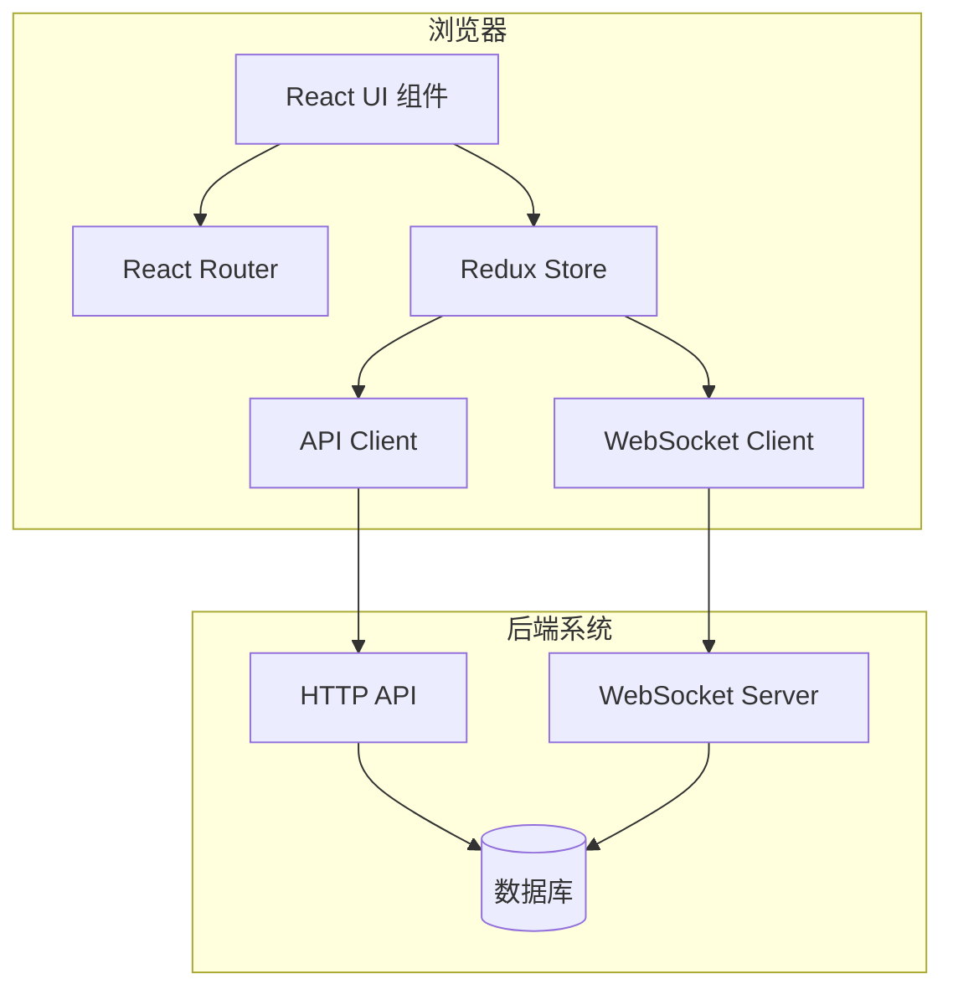

# 设计文档：Web Dashboard

## 概述

Web Dashboard 是一个基于 React 和 TypeScript 的现代化单页应用程序（SPA），为 Mochi-Link Minecraft 统一管理系统提供直观的网页界面。该应用程序采用组件化架构，使用 React Router 进行路由管理，使用 Redux Toolkit 进行状态管理，并通过 Axios 和原生 WebSocket API 与后端系统通信。

设计重点：
- 响应式设计，支持桌面和移动设备
- 实时数据更新通过 WebSocket 实现
- 模块化组件架构便于维护和扩展
- 类型安全的 TypeScript 实现
- 支持全版本 Minecraft 服务器（Java 版和基岩版）

## 架构

### 整体架构



### 技术栈

**核心框架：**
- React 18+ - UI 框架
- TypeScript 5+ - 类型安全
- Vite - 构建工具和开发服务器

**状态管理：**
- Redux Toolkit - 全局状态管理
- RTK Query - API 数据缓存和同步

**路由：**
- React Router v6 - 客户端路由

**UI 组件库：**
- Ant Design (antd) - 企业级 UI 组件
- Recharts - 图表库
- Tailwind CSS - 实用优先的 CSS 框架

**通信：**
- Axios - HTTP 客户端
- 原生 WebSocket API - 实时通信

**表单处理：**
- React Hook Form - 表单状态管理
- Zod - 运行时类型验证

## 组件和接口

### 1. 应用程序结构

```
web-dashboard/
├── src/
│   ├── components/          # 可复用 UI 组件
│   │   ├── common/         # 通用组件（按钮、输入框等）
│   │   ├── layout/         # 布局组件（导航、侧边栏等）
│   │   └── charts/         # 图表组件
│   ├── features/           # 功能模块
│   │   ├── auth/          # 认证功能
│   │   ├── dashboard/     # 仪表板功能
│   │   ├── servers/       # 服务器管理
│   │   ├── players/       # 玩家管理
│   │   ├── commands/      # 命令执行
│   │   └── events/        # 事件日志
│   ├── services/          # API 和 WebSocket 服务
│   │   ├── api/          # HTTP API 客户端
│   │   └── websocket/    # WebSocket 客户端
│   ├── store/            # Redux store 配置
│   ├── hooks/            # 自定义 React hooks
│   ├── types/            # TypeScript 类型定义
│   ├── utils/            # 工具函数
│   └── App.tsx           # 根组件
```

### 2. 核心组件

#### 2.1 布局组件

**AppLayout**
```typescript
interface AppLayoutProps {
  children: React.ReactNode;
}

// 提供应用程序的主要布局结构
// 包含：顶部导航栏、侧边栏、主内容区域、通知区域
```

**Sidebar**
```typescript
interface SidebarProps {
  collapsed: boolean;
  onCollapse: (collapsed: boolean) => void;
}

// 侧边导航菜单
// 根据用户角色显示可访问的功能模块
```

**TopBar**
```typescript
interface TopBarProps {
  user: User;
  onLogout: () => void;
}

// 顶部导航栏
// 显示：用户信息、通知图标、设置入口
```

#### 2.2 认证组件

**LoginForm**
```typescript
interface LoginFormProps {
  onSuccess: (token: string) => void;
  onError: (error: string) => void;
}

interface LoginCredentials {
  username: string;
  password: string;
}

// 登录表单组件
// 处理用户认证并存储 JWT token
```

**ProtectedRoute**
```typescript
interface ProtectedRouteProps {
  children: React.ReactNode;
  requiredRole?: UserRole;
}

// 路由守卫组件
// 检查用户认证状态和权限
```

#### 2.3 仪表板组件

**DashboardOverview**
```typescript
interface DashboardOverviewProps {
  timeRange: TimeRange;
}

// 主仪表板视图
// 显示：服务器状态概览、玩家统计、系统资源使用
```

**ServerStatusCard**
```typescript
interface ServerStatusCardProps {
  server: ServerInstance;
  metrics: ServerMetrics;
}

interface ServerMetrics {
  playerCount: number;
  tps: number;
  cpuUsage: number;
  memoryUsage: number;
  status: 'online' | 'offline' | 'starting' | 'stopping';
}

// 单个服务器状态卡片
// 显示实时服务器指标
```

**MetricsChart**
```typescript
interface MetricsChartProps {
  data: MetricDataPoint[];
  type: 'line' | 'bar' | 'area';
  metric: 'players' | 'tps' | 'cpu' | 'memory';
}

interface MetricDataPoint {
  timestamp: number;
  value: number;
}

// 指标图表组件
// 使用 Recharts 渲染时间序列数据
```

#### 2.4 服务器管理组件

**ServerList**
```typescript
interface ServerListProps {
  servers: ServerInstance[];
  onEdit: (server: ServerInstance) => void;
  onDelete: (serverId: string) => void;
}

// 服务器列表视图
// 支持搜索、过滤、排序
```

**ServerForm**
```typescript
interface ServerFormProps {
  server?: ServerInstance;
  onSubmit: (data: ServerFormData) => void;
  onCancel: () => void;
}

interface ServerFormData {
  name: string;
  type: ServerType;
  host: string;
  port: number;
  connectorConfig: ConnectorConfig;
}

type ServerType = 
  | 'vanilla'
  | 'paper' | 'spigot' | 'bukkit'
  | 'fabric'
  | 'forge' | 'neoforge'
  | 'pmmp' | 'nukkit' | 'llbds';

// 服务器添加/编辑表单
// 根据服务器类型动态显示配置选项
```

**ConnectorConfigForm**
```typescript
interface ConnectorConfigFormProps {
  serverType: ServerType;
  config: ConnectorConfig;
  onChange: (config: ConnectorConfig) => void;
}

// 连接器配置表单
// 为不同服务器类型提供特定配置界面
```

#### 2.5 玩家管理组件

**PlayerList**
```typescript
interface PlayerListProps {
  players: PlayerRecord[];
  onPlayerSelect: (player: PlayerRecord) => void;
}

interface PlayerRecord {
  uuid: string;
  username: string;
  lastSeen: Date;
  serverName: string;
  isOnline: boolean;
}

// 玩家列表视图
// 支持搜索、过滤、分页
```

**PlayerDetail**
```typescript
interface PlayerDetailProps {
  player: PlayerRecord;
  onAction: (action: PlayerAction) => void;
}

type PlayerAction = 
  | { type: 'kick'; reason: string }
  | { type: 'ban'; duration: number; reason: string }
  | { type: 'warn'; message: string };

// 玩家详情视图
// 显示玩家信息和活动历史
// 提供管理操作按钮
```

#### 2.6 命令执行组件

**CommandConsole**
```typescript
interface CommandConsoleProps {
  serverId: string;
  onCommandExecute: (command: string) => void;
}

interface CommandHistoryItem {
  id: string;
  command: string;
  output: string;
  timestamp: Date;
  status: 'success' | 'error';
}

// 命令控制台组件
// 提供命令输入、输出显示、历史记录
```

#### 2.7 事件日志组件

**EventLog**
```typescript
interface EventLogProps {
  events: SystemEvent[];
  filters: EventFilter;
  onFilterChange: (filters: EventFilter) => void;
}

interface SystemEvent {
  id: string;
  type: EventType;
  severity: 'info' | 'warning' | 'error' | 'critical';
  message: string;
  timestamp: Date;
  serverId?: string;
  playerId?: string;
}

type EventType = 
  | 'player_join' | 'player_leave'
  | 'server_start' | 'server_stop'
  | 'command_executed'
  | 'system_alert';

// 事件日志组件
// 实时显示系统事件
// 支持过滤和搜索
```

**NotificationCenter**
```typescript
interface NotificationCenterProps {
  notifications: Notification[];
  onDismiss: (id: string) => void;
  onDismissAll: () => void;
}

interface Notification {
  id: string;
  type: 'info' | 'success' | 'warning' | 'error';
  title: string;
  message: string;
  timestamp: Date;
  read: boolean;
}

// 通知中心组件
// 显示重要事件通知
```

### 3. 服务层

#### 3.1 API 客户端

**ApiClient**
```typescript
class ApiClient {
  private baseURL: string;
  private axiosInstance: AxiosInstance;
  
  constructor(baseURL: string) {
    this.baseURL = baseURL;
    this.axiosInstance = axios.create({
      baseURL,
      timeout: 10000,
      headers: {
        'Content-Type': 'application/json'
      }
    });
    
    // 添加请求拦截器（添加 JWT token）
    this.setupInterceptors();
  }
  
  // 认证
  async login(credentials: LoginCredentials): Promise<AuthResponse>;
  async logout(): Promise<void>;
  async refreshToken(): Promise<string>;
  
  // 服务器管理
  async getServers(): Promise<ServerInstance[]>;
  async getServer(id: string): Promise<ServerInstance>;
  async createServer(data: ServerFormData): Promise<ServerInstance>;
  async updateServer(id: string, data: ServerFormData): Promise<ServerInstance>;
  async deleteServer(id: string): Promise<void>;
  
  // 玩家管理
  async getPlayers(filters?: PlayerFilter): Promise<PlayerRecord[]>;
  async getPlayer(uuid: string): Promise<PlayerRecord>;
  async kickPlayer(uuid: string, reason: string): Promise<void>;
  async banPlayer(uuid: string, duration: number, reason: string): Promise<void>;
  
  // 命令执行
  async executeCommand(serverId: string, command: string): Promise<CommandResult>;
  
  // 指标数据
  async getMetrics(serverId: string, timeRange: TimeRange): Promise<MetricDataPoint[]>;
  
  // 事件日志
  async getEvents(filters: EventFilter): Promise<SystemEvent[]>;
}
```

#### 3.2 WebSocket 客户端

**WebSocketClient**
```typescript
class WebSocketClient {
  private ws: WebSocket | null = null;
  private url: string;
  private reconnectAttempts: number = 0;
  private maxReconnectAttempts: number = 5;
  private reconnectDelay: number = 3000;
  private eventHandlers: Map<string, Set<EventHandler>>;
  
  constructor(url: string) {
    this.url = url;
    this.eventHandlers = new Map();
  }
  
  connect(token: string): void {
    // 建立 WebSocket 连接
    // 发送认证消息
  }
  
  disconnect(): void {
    // 关闭连接
  }
  
  on(eventType: string, handler: EventHandler): void {
    // 注册事件处理器
  }
  
  off(eventType: string, handler: EventHandler): void {
    // 移除事件处理器
  }
  
  private handleMessage(message: WebSocketMessage): void {
    // 处理接收到的消息
    // 分发到相应的事件处理器
  }
  
  private reconnect(): void {
    // 自动重连逻辑
  }
}

interface WebSocketMessage {
  type: string;
  data: any;
  timestamp: number;
}

type EventHandler = (data: any) => void;
```

### 4. 状态管理

#### 4.1 Redux Store 结构

```typescript
interface RootState {
  auth: AuthState;
  servers: ServersState;
  players: PlayersState;
  commands: CommandsState;
  events: EventsState;
  metrics: MetricsState;
  ui: UIState;
}

interface AuthState {
  user: User | null;
  token: string | null;
  isAuthenticated: boolean;
  loading: boolean;
  error: string | null;
}

interface ServersState {
  servers: ServerInstance[];
  selectedServer: ServerInstance | null;
  loading: boolean;
  error: string | null;
}

interface PlayersState {
  players: PlayerRecord[];
  selectedPlayer: PlayerRecord | null;
  filters: PlayerFilter;
  loading: boolean;
  error: string | null;
}

interface CommandsState {
  history: CommandHistoryItem[];
  executing: boolean;
  error: string | null;
}

interface EventsState {
  events: SystemEvent[];
  filters: EventFilter;
  unreadCount: number;
}

interface MetricsState {
  data: Record<string, MetricDataPoint[]>;
  timeRange: TimeRange;
  loading: boolean;
}

interface UIState {
  sidebarCollapsed: boolean;
  theme: 'light' | 'dark';
  notifications: Notification[];
}
```

#### 4.2 Redux Slices

每个功能模块都有对应的 Redux slice：
- `authSlice` - 认证状态管理
- `serversSlice` - 服务器状态管理
- `playersSlice` - 玩家状态管理
- `commandsSlice` - 命令历史管理
- `eventsSlice` - 事件日志管理
- `metricsSlice` - 指标数据管理
- `uiSlice` - UI 状态管理

### 5. 自定义 Hooks

**useAuth**
```typescript
function useAuth() {
  const dispatch = useDispatch();
  const auth = useSelector((state: RootState) => state.auth);
  
  const login = async (credentials: LoginCredentials) => {
    // 登录逻辑
  };
  
  const logout = () => {
    // 登出逻辑
  };
  
  return { ...auth, login, logout };
}
```

**useWebSocket**
```typescript
function useWebSocket() {
  const [connected, setConnected] = useState(false);
  const wsClient = useRef<WebSocketClient | null>(null);
  
  useEffect(() => {
    // 初始化 WebSocket 连接
    // 清理函数
  }, []);
  
  const subscribe = (eventType: string, handler: EventHandler) => {
    // 订阅事件
  };
  
  return { connected, subscribe };
}
```

**useRealTimeMetrics**
```typescript
function useRealTimeMetrics(serverId: string) {
  const [metrics, setMetrics] = useState<ServerMetrics | null>(null);
  const { subscribe } = useWebSocket();
  
  useEffect(() => {
    // 订阅服务器指标更新
    const unsubscribe = subscribe(`metrics:${serverId}`, (data) => {
      setMetrics(data);
    });
    
    return unsubscribe;
  }, [serverId]);
  
  return metrics;
}
```

## 数据模型

### 用户和认证

```typescript
interface User {
  id: string;
  username: string;
  email: string;
  role: UserRole;
  permissions: Permission[];
  createdAt: Date;
  lastLogin: Date;
}

type UserRole = 'admin' | 'operator' | 'moderator' | 'viewer';

type Permission = 
  | 'servers:read' | 'servers:write' | 'servers:delete'
  | 'players:read' | 'players:write' | 'players:ban'
  | 'commands:execute'
  | 'events:read'
  | 'users:manage';

interface AuthResponse {
  token: string;
  refreshToken: string;
  user: User;
  expiresIn: number;
}
```

### 服务器

```typescript
interface ServerInstance {
  id: string;
  name: string;
  type: ServerType;
  host: string;
  port: number;
  status: ServerStatus;
  connectorVersion: string;
  connectorConfig: ConnectorConfig;
  createdAt: Date;
  updatedAt: Date;
}

type ServerStatus = 'online' | 'offline' | 'starting' | 'stopping' | 'error';

interface ConnectorConfig {
  // 通用配置
  apiKey: string;
  reportInterval: number;
  
  // 类型特定配置
  javaConfig?: JavaServerConfig;
  bedrockConfig?: BedrockServerConfig;
}

interface JavaServerConfig {
  javaVersion: string;
  minMemory: string;
  maxMemory: string;
  jvmArgs: string[];
}

interface BedrockServerConfig {
  levelName: string;
  gamemode: string;
  difficulty: string;
}
```

### 玩家

```typescript
interface PlayerRecord {
  uuid: string;
  username: string;
  displayName: string;
  isOnline: boolean;
  currentServer: string | null;
  firstSeen: Date;
  lastSeen: Date;
  playTime: number;
  ipAddress: string;
  banned: boolean;
  banReason: string | null;
  banExpires: Date | null;
}

interface PlayerFilter {
  search?: string;
  server?: string;
  online?: boolean;
  banned?: boolean;
}
```

### 命令和事件

```typescript
interface CommandResult {
  success: boolean;
  output: string;
  executedAt: Date;
  executionTime: number;
}

interface SystemEvent {
  id: string;
  type: EventType;
  severity: EventSeverity;
  message: string;
  details: Record<string, any>;
  serverId?: string;
  playerId?: string;
  timestamp: Date;
}

type EventSeverity = 'info' | 'warning' | 'error' | 'critical';

interface EventFilter {
  types?: EventType[];
  severity?: EventSeverity[];
  serverId?: string;
  startTime?: Date;
  endTime?: Date;
}
```

### 指标

```typescript
interface ServerMetrics {
  serverId: string;
  timestamp: Date;
  playerCount: number;
  maxPlayers: number;
  tps: number;
  cpuUsage: number;
  memoryUsage: number;
  memoryTotal: number;
  diskUsage: number;
  diskTotal: number;
  networkIn: number;
  networkOut: number;
}

interface TimeRange {
  start: Date;
  end: Date;
  interval: '1m' | '5m' | '15m' | '1h' | '1d';
}
```

## 正确性属性

*属性是一个特征或行为，应该在系统的所有有效执行中保持为真——本质上是关于系统应该做什么的正式陈述。属性作为人类可读规范和机器可验证正确性保证之间的桥梁。*


### 属性 1: API 客户端 CRUD 操作正确性
*对于任意* CRUD 操作（创建、读取、更新、删除）和资源类型（服务器、玩家、事件），API 客户端应该发送正确格式的 HTTP 请求到相应的端点，并正确处理响应
**验证需求：1.5, 8.1**

### 属性 2: 玩家统计聚合正确性
*对于任意* 服务器集合，仪表板应该正确计算和显示所有服务器的总玩家数量
**验证需求：2.2**

### 属性 3: WebSocket 实时更新
*对于任意* WebSocket 消息（指标更新、事件通知），当消息到达时，相应的 UI 组件应该自动更新显示最新数据
**验证需求：2.3, 6.1**

### 属性 4: 时间范围过滤
*对于任意* 时间范围选择和指标数据集，仪表板应该只显示该时间范围内的数据点
**验证需求：2.5**

### 属性 5: 服务器类型特定配置显示
*对于任意* 服务器类型（Vanilla、Paper、Spigot、Bukkit、Fabric、Forge、NeoForge、PMMP、Nukkit、LLBDS），当选择该类型时，表单应该显示该类型特定的配置字段，并隐藏其他类型的字段
**验证需求：3.1, 3.3, 3.4, 10.3, 10.4**

### 属性 6: 服务器配置验证
*对于任意* 服务器类型和配置数据，如果配置不满足该类型的必需字段要求，表单验证应该拒绝提交并显示具体的错误消息
**验证需求：3.5**

### 属性 7: 多字段玩家搜索
*对于任意* 搜索查询字符串和玩家列表，搜索结果应该包含所有在用户名、UUID 或服务器名称中匹配该查询的玩家
**验证需求：4.1, 4.2**

### 属性 8: 玩家列表排序
*对于任意* 排序标准（用户名、最后在线时间、服务器等）和排序方向（升序/降序），玩家列表应该按照指定标准正确排序
**验证需求：4.3**

### 属性 9: 玩家详情完整性
*对于任意* 玩家记录，详情视图应该显示所有必需字段：UUID、用户名、在线状态、当前服务器、首次/最后在线时间、游戏时长、封禁状态
**验证需求：4.4**

### 属性 10: 基于角色的操作可见性
*对于任意* 用户角色和操作类型，UI 应该只显示该角色有权限执行的操作按钮，并隐藏无权限的操作
**验证需求：4.5, 7.4**

### 属性 11: 命令 API 调用正确性
*对于任意* 服务器 ID 和命令字符串，执行命令时应该向正确的 API 端点发送包含服务器 ID 和命令内容的请求
**验证需求：5.2**

### 属性 12: 命令输出显示
*对于任意* 命令执行结果（成功或失败），命令界面应该在输出区域显示结果内容和执行状态
**验证需求：5.3**

### 属性 13: 命令历史增长
*对于任意* 初始命令历史列表，执行新命令后，历史列表的长度应该增加 1，且新命令应该出现在列表中
**验证需求：5.4**

### 属性 14: 命令错误处理
*对于任意* 失败的命令执行，界面应该显示包含错误类型和描述的错误消息
**验证需求：5.5**

### 属性 15: 事件分类和显示
*对于任意* 系统事件，事件日志应该显示该事件并标注正确的类型标签（玩家操作、服务器事件、系统警报）和时间戳
**验证需求：6.2, 6.5**

### 属性 16: 关键事件通知触发
*对于任意* 严重级别为 "critical" 或 "error" 的事件，系统应该触发通知显示，且通知内容应该包含事件信息
**验证需求：6.3**

### 属性 17: 事件过滤
*对于任意* 事件过滤条件（类型、严重级别、服务器、时间范围），事件日志应该只显示满足所有过滤条件的事件
**验证需求：6.4**

### 属性 18: 会话建立和权限
*对于任意* 成功的登录操作，应该建立包含用户信息、角色和权限列表的会话状态
**验证需求：7.3**

### 属性 19: 会话过期重定向
*对于任意* 过期的认证 token，当尝试访问受保护的页面时，应该重定向到登录页面
**验证需求：7.5**

### 属性 20: API 错误处理
*对于任意* 失败的 API 请求（4xx 或 5xx 状态码），应该显示用户友好的错误消息，而不是原始错误信息
**验证需求：8.3**

### 属性 21: 加载状态显示
*对于任意* 进行中的 API 请求，相应的 UI 区域应该显示加载指示器，请求完成后应该隐藏指示器
**验证需求：8.4**

### 属性 22: WebSocket 自动重连
*对于任意* WebSocket 连接断开事件，客户端应该在指定延迟后自动尝试重新连接，最多尝试配置的最大次数
**验证需求：8.5**

### 属性 23: 用户偏好持久化往返
*对于任意* 用户偏好设置（仪表板布局、过滤器、主题），保存后刷新浏览器，应该恢复相同的偏好设置
**验证需求：9.1, 9.4**

### 属性 24: 导航状态保持
*对于任意* 页面状态（滚动位置、展开的面板、选中的项目），导航到其他页面后返回，相关状态应该保持不变
**验证需求：9.2**

### 属性 25: API 响应缓存
*对于任意* 可缓存的 API 请求，第二次请求相同数据时应该使用缓存而不是发送新的网络请求（在缓存有效期内）
**验证需求：9.3**

### 属性 26: 离线状态处理
*对于任意* 网络断开场景，应用程序应该检测到离线状态并显示离线提示，恢复连接后应该自动更新状态
**验证需求：9.5**

### 属性 27: 服务器连接器信息显示
*对于任意* 服务器实例，服务器列表和详情视图应该显示该服务器的连接器状态（在线/离线）和连接器版本号
**验证需求：10.5**

## 错误处理

### 网络错误

**连接失败**
- 检测 API 请求超时或连接失败
- 显示用户友好的错误消息："无法连接到服务器，请检查网络连接"
- 提供重试按钮
- 记录错误详情到控制台供调试

**WebSocket 断开**
- 检测 WebSocket 连接断开
- 显示连接状态指示器（已连接/断开）
- 自动尝试重连（指数退避策略）
- 达到最大重连次数后提示用户手动刷新

### API 错误

**4xx 客户端错误**
- 400 Bad Request: "请求数据格式错误，请检查输入"
- 401 Unauthorized: 清除会话并重定向到登录页面
- 403 Forbidden: "您没有权限执行此操作"
- 404 Not Found: "请求的资源不存在"
- 422 Validation Error: 显示具体的字段验证错误

**5xx 服务器错误**
- 500 Internal Server Error: "服务器内部错误，请稍后重试"
- 503 Service Unavailable: "服务暂时不可用，请稍后重试"
- 显示错误 ID（如果后端提供）供技术支持使用

### 表单验证错误

**客户端验证**
- 使用 Zod schema 进行实时验证
- 在字段失去焦点时显示验证错误
- 阻止提交无效表单
- 高亮显示错误字段

**服务器端验证**
- 显示后端返回的验证错误
- 将错误映射到相应的表单字段
- 如果无法映射，显示通用错误消息

### 数据加载错误

**空状态**
- 无数据时显示友好的空状态提示
- 提供相关操作建议（如"添加第一个服务器"）

**加载失败**
- 显示错误消息和重试按钮
- 保留之前加载的数据（如果有）
- 记录错误供调试

### 权限错误

**未认证访问**
- 重定向到登录页面
- 保存原始请求的 URL，登录后自动跳转

**权限不足**
- 显示 403 错误页面
- 提供返回首页的链接
- 不显示用户无权访问的功能

## 测试策略

### 单元测试

使用 **Vitest** 和 **React Testing Library** 进行组件和函数的单元测试。

**测试范围：**

1. **组件渲染测试**
   - 验证组件在不同 props 下正确渲染
   - 测试条件渲染逻辑
   - 验证事件处理器正确绑定

2. **工具函数测试**
   - 测试数据转换函数
   - 测试验证函数
   - 测试格式化函数

3. **Redux Slice 测试**
   - 测试 reducer 正确更新状态
   - 测试 action creator
   - 测试 selector 函数

4. **API 客户端测试**
   - 使用 Mock Service Worker (MSW) 模拟 API
   - 测试请求参数正确性
   - 测试响应处理逻辑
   - 测试错误处理

5. **自定义 Hook 测试**
   - 使用 @testing-library/react-hooks
   - 测试 hook 状态变化
   - 测试副作用清理

**示例测试：**

```typescript
// ServerList.test.tsx
describe('ServerList', () => {
  it('应该渲染所有服务器', () => {
    const servers = [
      { id: '1', name: 'Server 1', type: 'paper', status: 'online' },
      { id: '2', name: 'Server 2', type: 'fabric', status: 'offline' }
    ];
    
    render(<ServerList servers={servers} onEdit={vi.fn()} onDelete={vi.fn()} />);
    
    expect(screen.getByText('Server 1')).toBeInTheDocument();
    expect(screen.getByText('Server 2')).toBeInTheDocument();
  });
  
  it('应该在点击编辑按钮时调用 onEdit', () => {
    const onEdit = vi.fn();
    const servers = [{ id: '1', name: 'Server 1', type: 'paper', status: 'online' }];
    
    render(<ServerList servers={servers} onEdit={onEdit} onDelete={vi.fn()} />);
    
    fireEvent.click(screen.getByRole('button', { name: /编辑/i }));
    
    expect(onEdit).toHaveBeenCalledWith(servers[0]);
  });
});
```

### 属性测试

使用 **fast-check** 进行基于属性的测试，验证通用正确性属性。

**配置：**
- 每个属性测试运行最少 100 次迭代
- 使用自定义生成器生成测试数据
- 每个测试标注对应的设计属性编号

**测试范围：**

1. **数据转换属性**
   - 往返属性（序列化/反序列化）
   - 不变量保持

2. **搜索和过滤属性**
   - 搜索结果包含性
   - 过滤结果正确性

3. **排序属性**
   - 排序顺序正确性
   - 稳定排序

4. **状态管理属性**
   - 状态更新一致性
   - 副作用幂等性

**示例属性测试：**

```typescript
// playerSearch.property.test.ts
import fc from 'fast-check';

describe('玩家搜索属性测试', () => {
  // Feature: web-dashboard, Property 7: 多字段玩家搜索
  it('属性 7: 搜索结果应该包含所有匹配字段的玩家', () => {
    fc.assert(
      fc.property(
        fc.array(playerRecordArbitrary()),
        fc.string({ minLength: 1, maxLength: 20 }),
        (players, query) => {
          const results = searchPlayers(players, query);
          
          // 所有结果都应该匹配查询
          results.forEach(player => {
            const matches = 
              player.username.includes(query) ||
              player.uuid.includes(query) ||
              player.serverName.includes(query);
            expect(matches).toBe(true);
          });
          
          // 所有匹配的玩家都应该在结果中
          players.forEach(player => {
            const shouldMatch = 
              player.username.includes(query) ||
              player.uuid.includes(query) ||
              player.serverName.includes(query);
            
            if (shouldMatch) {
              expect(results).toContainEqual(player);
            }
          });
        }
      ),
      { numRuns: 100 }
    );
  });
  
  // Feature: web-dashboard, Property 8: 玩家列表排序
  it('属性 8: 排序后的列表应该保持正确顺序', () => {
    fc.assert(
      fc.property(
        fc.array(playerRecordArbitrary()),
        fc.constantFrom('username', 'lastSeen', 'serverName'),
        fc.constantFrom('asc', 'desc'),
        (players, sortBy, direction) => {
          const sorted = sortPlayers(players, sortBy, direction);
          
          // 验证排序顺序
          for (let i = 0; i < sorted.length - 1; i++) {
            const current = sorted[i][sortBy];
            const next = sorted[i + 1][sortBy];
            
            if (direction === 'asc') {
              expect(current <= next).toBe(true);
            } else {
              expect(current >= next).toBe(true);
            }
          }
        }
      ),
      { numRuns: 100 }
    );
  });
});

// 自定义生成器
function playerRecordArbitrary() {
  return fc.record({
    uuid: fc.uuid(),
    username: fc.string({ minLength: 3, maxLength: 16 }),
    serverName: fc.constantFrom('server1', 'server2', 'server3'),
    lastSeen: fc.date(),
    isOnline: fc.boolean()
  });
}
```

### 集成测试

测试多个组件和服务的集成。

**测试范围：**

1. **页面级测试**
   - 测试完整的用户流程
   - 验证组件间交互
   - 测试路由导航

2. **API 集成测试**
   - 测试完整的请求/响应周期
   - 测试错误处理流程
   - 测试认证流程

3. **WebSocket 集成测试**
   - 测试连接建立
   - 测试消息接收和处理
   - 测试重连机制

**示例集成测试：**

```typescript
// serverManagement.integration.test.tsx
describe('服务器管理集成测试', () => {
  it('应该完成添加服务器的完整流程', async () => {
    const { user } = renderWithProviders(<ServerManagementPage />);
    
    // 点击添加服务器按钮
    await user.click(screen.getByRole('button', { name: /添加服务器/i }));
    
    // 填写表单
    await user.type(screen.getByLabelText(/服务器名称/i), 'Test Server');
    await user.selectOptions(screen.getByLabelText(/服务器类型/i), 'paper');
    await user.type(screen.getByLabelText(/主机地址/i), 'localhost');
    await user.type(screen.getByLabelText(/端口/i), '25565');
    
    // 提交表单
    await user.click(screen.getByRole('button', { name: /保存/i }));
    
    // 验证 API 调用
    await waitFor(() => {
      expect(mockApiClient.createServer).toHaveBeenCalledWith({
        name: 'Test Server',
        type: 'paper',
        host: 'localhost',
        port: 25565
      });
    });
    
    // 验证服务器出现在列表中
    expect(await screen.findByText('Test Server')).toBeInTheDocument();
  });
});
```

### E2E 测试

使用 **Playwright** 进行端到端测试。

**测试范围：**

1. **关键用户流程**
   - 登录流程
   - 服务器管理流程
   - 玩家管理流程
   - 命令执行流程

2. **跨浏览器测试**
   - Chrome
   - Firefox
   - Safari

3. **响应式测试**
   - 桌面视口
   - 平板视口
   - 移动视口

**示例 E2E 测试：**

```typescript
// login.e2e.test.ts
import { test, expect } from '@playwright/test';

test('用户登录流程', async ({ page }) => {
  await page.goto('http://localhost:5173');
  
  // 应该显示登录页面
  await expect(page.locator('h1')).toContainText('登录');
  
  // 填写登录表单
  await page.fill('input[name="username"]', 'admin');
  await page.fill('input[name="password"]', 'password123');
  
  // 提交表单
  await page.click('button[type="submit"]');
  
  // 应该重定向到仪表板
  await expect(page).toHaveURL(/\/dashboard/);
  await expect(page.locator('h1')).toContainText('仪表板');
});
```

### 测试覆盖率目标

- 单元测试：80% 代码覆盖率
- 集成测试：覆盖所有主要用户流程
- E2E 测试：覆盖所有关键业务流程
- 属性测试：覆盖所有设计文档中的正确性属性

### 持续集成

- 所有测试在 PR 提交时自动运行
- 测试失败阻止合并
- 生成测试覆盖率报告
- E2E 测试在主分支合并后运行